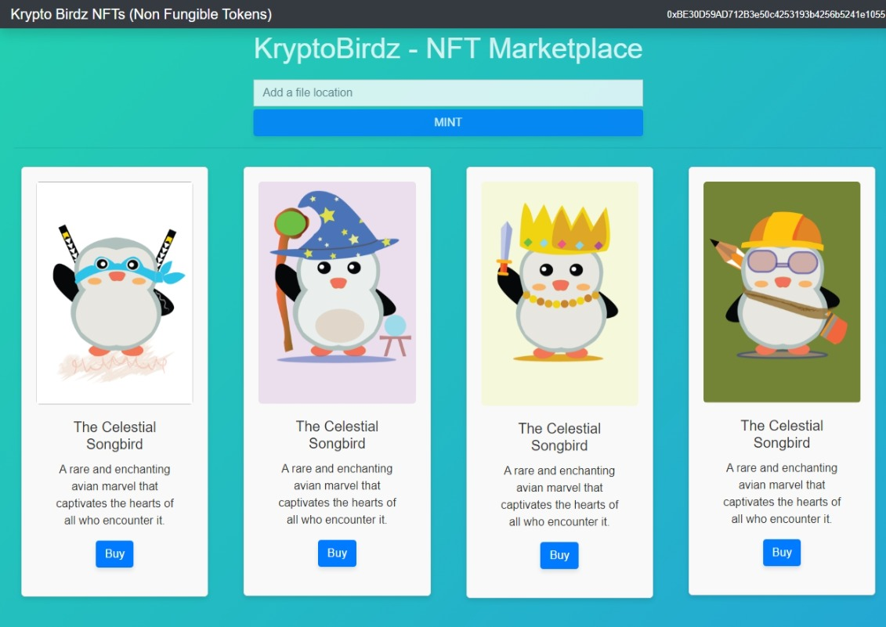

<div align="center">
  <h1> KryptoBirdz NFT Marketplace </h1>
</div>
<p align="center">
  
</p>

## Table of Contents
- [Introduction](#introduction)
- [Technologies](#technologies)
- [Features](#features)
- [Installation](#installation)
- [Usage](#usage)
- [Contributing](#contributing)
- [License](#license)

## Introduction
KryptoBirdz is a decentralized NFT (Non-Fungible Token) Marketplace that allows users to mint, sell, and buy unique digital assets on the Ethereum blockchain. This project utilizes cutting-edge technologies to provide a seamless and secure experience for users.

## Technologies
- **Frontend**: ReactJS
- **Backend**: Node.js
- **Smart Contracts**: Solidity
- **Blockchain**: Ethereum
- **Web3 Provider**: Metamask
- **Testing**: Truffle
- **UI**: Material Design Bootstrap
- **Package Manager**: npm
- **Version Control**: Git

## Additional Libraries
- **Web3.js**: Ethereum JavaScript API
- **@metamask/detect-provider**: For detecting Metamask
- **react-bootstrap**: For UI components

## Features
- Mint your unique KryptoBirdz
- List KryptoBirdz for sale
- Buy KryptoBirdz from other users
- Secure transactions through Ethereum Smart Contracts
- User-friendly UI
- Real-time updates via Web3
- Filter and sort options for listed NFTs

## Installation
```bash
# Clone the repository
git clone https://github.com/Damika-s-Play-Ground/NFT-market-place-playground.git

# Navigate to the project directory
cd KryptoBirdz

# Install dependencies
npm install

# Start the local development server
npm start

# Compile the smart contracts
truffle compile

# Migrate the smart contracts to the local blockchain
truffle migrate

# Run the tests
truffle test
```

## Usage
1. Install Metamask extension in your browser and set up an account.
2. Connect Metamask to the local Ethereum network.
3. Open the application and start minting or trading KryptoBirdz.

## Contributing
Contributions are welcome!

## License
This project is licensed under the [MIT License](./LICENSE.md).